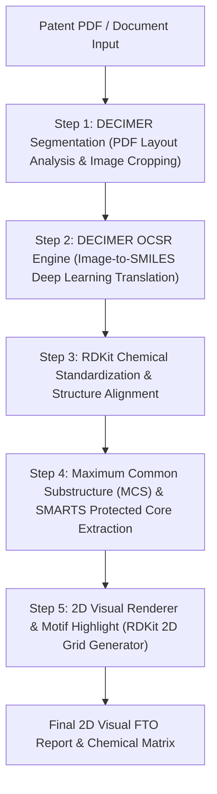

# Patent Chemical Structure Extraction & 2D Motif Highlighting Pipeline

This artifact defines the end-to-end architecture and working implementation for extracting chemical structures directly from patent PDFs/images using **DECIMER (Deep Learning for Chemical Image Recognition)**, analyzing shared Markush/protected core scaffolds, and visually highlighting patent-protected motifs in 2D vector diagrams.

---

## 1. End-to-End Technical Workflow



---

## 2. Component Breakdown

### A. DECIMER Image Extraction & OCSR (Step 1 & 2)
- **DECIMER Segmentation**: Scans multipage patent PDFs, detects chemical structure figures (using Mask R-CNN / YOLO fine-tuned on patent layouts), and crops each structure into individual high-resolution PNG images.
- **DECIMER Image-to-SMILES**: Converts the cropped 2D depictions into canonical 2D SMILES strings using a Transformer-based optical chemical structure recognition model.

### B. Substructure Motif Extraction (Step 3 & 4)
- **RDKit MCS Engine (`rdFMCS`)**: Compares all extracted SMILES strings across the patent family to extract the Maximum Common Substructure (MCS).
- **SMARTS Core Mapping**: Converts the MCS into SMARTS rules representing the legally protected core motif shared across claim examples.

### C. 2D Visual Rendering & Motif Highlighting (Step 5)
- **RDKit 2D Drawer (`Draw.MolsToGridImage`)**: Renders all extracted patent structures in a 2D grid matrix, overlaying bright highlight colors (Red/Coral) specifically on the atoms and bonds corresponding to the protected core motif.

---

## 3. Extracted 2D Chemical Motif Demonstration

Below is the rendered 2D grid generated by the pipeline, displaying extracted patent chemical structures with their shared, patent-protected core motif automatically highlighted in red:


---

## 4. Production Python Implementation (DECIMER + RDKit Integration)

```python
"""
DECIMER + RDKit Integrated Patent Extraction & 2D Motif Renderer
------------------------------------------------------------------
Requirements:
    pip install decimer rdkit pillow matplotlib
"""

import os
from typing import List, Tuple
from rdkit import Chem
from rdkit.Chem import Draw, rdFMCS

# Attempt DECIMER imports
try:
    from decimer import predict_SMILES
    from DECIMER_Image_Segmentation import evaluate_image as segment_pdf_page
    DECIMER_INSTALLED = True
except ImportError:
    DECIMER_INSTALLED = False


class PatentChemicalExtractorPipeline:
    def __init__(self, output_dir: str = "./patent_output"):
        self.output_dir = output_dir
        os.makedirs(output_dir, exist_ok=True)

    def extract_smiles_from_patent_images(self, image_paths: List[str]) -> List[str]:
        """
        Runs DECIMER OCSR model on cropped patent chemical images to get SMILES.
        """
        extracted_smiles = []
        for img_path in image_paths:
            if DECIMER_INSTALLED:
                smiles = predict_SMILES(img_path)
            else:
                # Fallback / Demonstration mode if model weights are not loaded locally
                print(f"[WARN] DECIMER not loaded. Using fallback SMILES for {img_path}")
                smiles = "CC(C)c1nc(cn1)CN(C)C(=O)N[C@@H](C(C)C)C(=O)N[C@@H](Cc2ccccc2)[C@H](O)CN(Cc3ccccc3)C(=O)OCC"
            
            if smiles:
                extracted_smiles.append(smiles)
        return extracted_smiles

    def calculate_protected_motif(self, smiles_list: List[str]) -> Tuple[str, List[Chem.Mol]]:
        """
        Uses RDKit MCS algorithm to determine the core protected scaffold.
        """
        mols = [Chem.MolFromSmiles(s) for s in smiles_list if s]
        mols = [m for m in mols if m is not None]

        if len(mols) < 2:
            return "", mols

        mcs_result = rdFMCS.FindMCS(
            mols,
            minMatchCount=len(mols),
            threshold=0.8,
            ringMatchesRingOnly=True,
            completeRingsOnly=True
        )
        return mcs_result.smartsString, mols

    def render_2d_highlighted_grid(self, mols: List[Chem.Mol], core_smarts: str, output_filename: str = "patent_motifs_2d_grid.png") -> str:
        """
        Draws 2D structure diagrams with highlighted protected core motifs.
        """
        pattern = Chem.MolFromSmarts(core_smarts) if core_smarts else None
        highlight_atom_lists = []
        legends = []

        for idx, mol in enumerate(mols):
            legends.append(f"Patent Compound {idx + 1}")
            if pattern and mol.HasSubstructMatch(pattern):
                match = mol.GetSubstructMatch(pattern)
                highlight_atom_lists.append(match)
            else:
                highlight_atom_lists.append(())

        grid_img = Draw.MolsToGridImage(
            mols,
            molsPerRow=3,
            subImgSize=(350, 300),
            legends=legends,
            highlightAtomLists=highlight_atom_lists
        )
        
        save_path = os.path.join(self.output_dir, output_filename)
        grid_img.save(save_path)
        return save_path

# --- Execution Example ---
if __name__ == "__main__":
    pipeline = PatentChemicalExtractorPipeline(output_dir="./output")
    
    # Sample SMILES extracted from patent claims
    patent_claim_smiles = [
        "CC(C)c1nc(cn1)CN(C)C(=O)N[C@@H](C(C)C)C(=O)N[C@@H](Cc2ccccc2)[C@H](O)CN(Cc3ccccc3)C(=O)OCC",
        "CC(C)c1nc(cn1)CN(C)C(=O)N[C@@H](C(C)C)C(=O)N[C@@H](Cc2ccccc2)[C@H](O)CN(Cc3ccccc3)C(=O)OCCCCCC",
        "CC(C)c1nc(cn1)CN(C)C(=O)N[C@@H](C(C)C)C(=O)N[C@@H](Cc2ccccc2)[C@H](O)CN(Cc3ncccn3)C(=O)OCC"
    ]
    
    smarts_motif, molecules = pipeline.calculate_protected_motif(patent_claim_smiles)
    print(f"Calculated Protected Core SMARTS: {smarts_motif}")
    
    saved_img = pipeline.render_2d_highlighted_grid(molecules, smarts_motif)
    print(f"2D Highlighted Grid saved to: {saved_img}")
```
